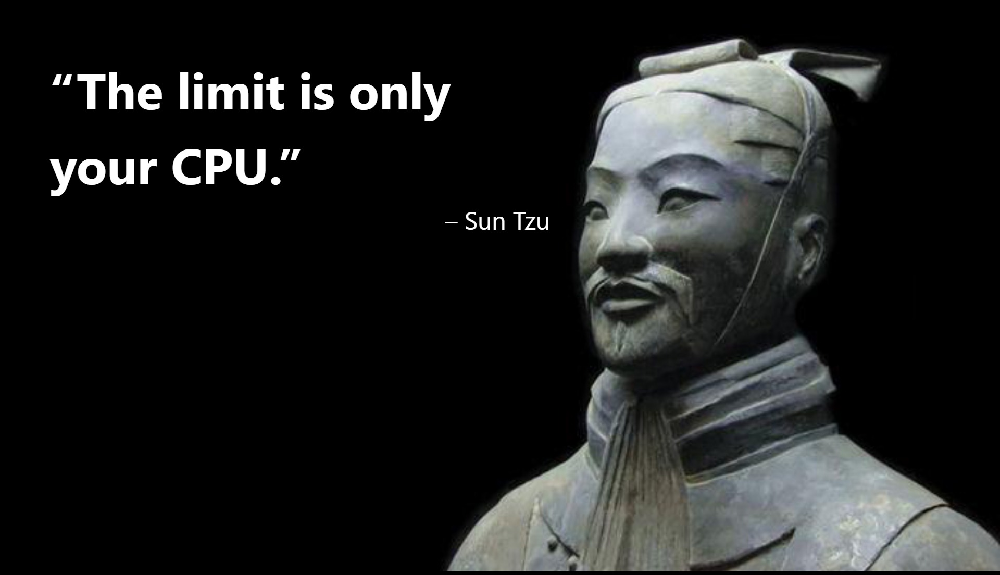

# URLX
URLX is a rhythm game played in your browser's address bar. (no it does not stand for anything it's just the best name i could think of)
- Hit arrows to the beat (or the spacebar, or maybe even both)
- Create charts directly from the site's editor, or tap one out in real time
- Save and load charts to/from .urlx or .urlzip files
- Import charts from other rhythm games

---

I'm still a pretty big newbie when it comes to making web games, so I'm definitely expecting someone to go *"ummm acshully you could have done it like this"* and rewrite every line of code.

I'm happy to accept any pull requests and contributions, but only if it's not too complicated to the point that I can't understand the code.

---

**Required libraries** - Create a folder called "libraries" and add these

[jquery 3.6.0](https://cdnjs.com/libraries/jquery) (go fuck yourself, it makes js syntax shorter and a lot more convenient)

[howler 2.2.3](https://cdnjs.com/libraries/howler) (handles audio stuff)

[jszip 3.10.1](https://cdnjs.com/libraries/jszip) (handles zipping)

(also twemoji but that one is directly fetched since it updates a lot)

## NOTICE

This is my fork of URLX, it's kinda unstable, but it has some "cool" features.  
Maybe in the future these features will be in offical version, but first I need to finish them.

### High bpm support (Infinity)

Sounds are broken.

### Osu importing (kinda done, except for speed changing) (PR made)

Song importing doesn't work btw.

### Adofai importing (80% done)

The tap thingys don't work  
and It doesn't work with faster songs

### High rate refreshing 

(see Settings -> Disable frame validating)

YOU MUST RUN CHROME WITH `--disable-ipc-flooding-protection` FLAG, you can do this by running `RunChromeFastRefresh.bat` file on Windows.

### Copy + Paste + Cut (Viprin mode)

Useful.
